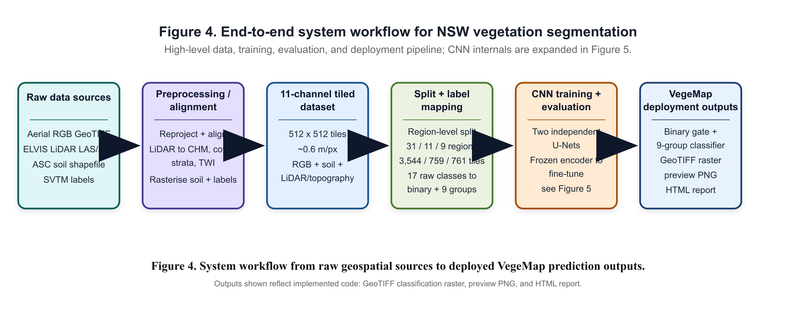
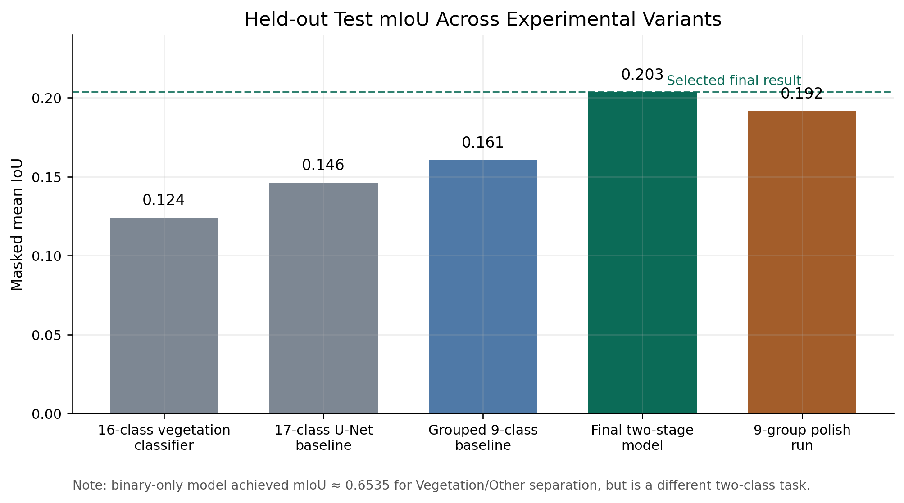

# NSW Vegetation Classifier

Portfolio repository for a deep learning system that classifies NSW vegetation from geospatial imagery. The project combines a browser interface, a FastAPI inference backend, and a two-stage TensorFlow segmentation pipeline trained on multi-channel GeoTIFF tiles.

[Portfolio page](https://tuilachit.github.io/NSW_Vegetation_Classifier/) · [Run locally](docs/project/run-locally.md) · [Model assets](docs/project/model-assets.md) · [Case study](docs/project/case-study.md)



## What This Project Does

The app accepts either:

- A model-ready `512 x 512`, 11-band GeoTIFF tile.
- A raw RGB GeoTIFF plus a matching ELVIS point-cloud zip for backend preprocessing.

The backend converts inputs into the training band order and runs a two-stage segmentation model:

1. Binary vegetation / non-vegetation gate.
2. Nine-group vegetation classifier for vegetation pixels.

Outputs include a colour-coded prediction map, class summary, downloadable prediction GeoTIFF, and an HTML report.

## Highlights

- End-to-end web app for geospatial model inference.
- FastAPI backend serving TensorFlow models.
- Raw preprocessing path for RGB imagery, LiDAR point clouds, ASC soil polygons, CHM, canopy cover, strata fractions, and TWI.
- Direct inference path for prepared 11-band model tiles.
- Region-aware evaluation outputs and diagnostic plots.
- Local deployment flow that keeps large model and soil assets outside normal Git history.

## Results Snapshot

| Component | Held-out test mIoU |
|---|---:|
| Binary vegetation gate | `0.6535` |
| Nine-group vegetation classifier | `0.2035` |



The grouped classifier remains a difficult segmentation task because several NSW vegetation formations are visually similar from aerial imagery and have uneven class support. The final interface focuses on making model behaviour inspectable through class summaries, preview maps, and exported rasters.

## Repository Layout

```text
.
├── index.html                # Frontend app shell
├── styles.css                # Frontend styling
├── app.js                    # Frontend workflow and API calls
├── backend/
│   ├── main.py               # FastAPI API
│   ├── requirements.txt      # Backend dependencies
│   ├── nsw_veg_inference/    # Model loading, preprocessing, inference
│   ├── model_assets/         # Weight/metadata placement folder
│   └── soil_assets/asc/      # ASC shapefile placement folder
├── docs/                     # GitHub Pages portfolio
├── render.yaml               # Backend deployment notes
└── vercel.json               # Static frontend deployment notes
```

## Local Setup

Start the backend:

```bash
cd backend
python3.11 -m venv .venv
source .venv/bin/activate
pip install -r requirements.txt
uvicorn main:app --host 127.0.0.1 --port 8000
```

Start the frontend:

```bash
python3 -m http.server 8080 --bind 127.0.0.1
```

Open:

```text
http://127.0.0.1:8080
```

Check backend health:

```bash
curl http://127.0.0.1:8000/health
```

Expected when the model and soil assets are installed:

```json
{
  "ok": true,
  "models_loaded": true,
  "missing_assets": [],
  "soil_assets_ready": true,
  "missing_soil_assets": []
}
```

## Model And Soil Assets

Large binary assets are not committed to this public repository.

Required backend model files:

```text
backend/model_assets/binary_veg_other_p2_best.weights.h5
backend/model_assets/group9_after_binary_p2_best.weights.h5
backend/model_assets/binary_run_metadata.json
backend/model_assets/group9_run_metadata.json
```

Required ASC soil files for raw RGB + ELVIS inference:

```text
backend/soil_assets/asc/SoilType_ASC_NSW_v4_5_210429.shp
backend/soil_assets/asc/SoilType_ASC_NSW_v4_5_210429.dbf
backend/soil_assets/asc/SoilType_ASC_NSW_v4_5_210429.shx
backend/soil_assets/asc/SoilType_ASC_NSW_v4_5_210429.prj
```

See [model-assets.md](docs/project/model-assets.md) for asset handling and release options.

## Tech Stack

- Python, TensorFlow, Keras
- FastAPI, Uvicorn
- Rasterio, GeoPandas, Shapely, PyProj, LasPy
- HTML, CSS, vanilla JavaScript
- GeoTIFF.js for browser-side GeoTIFF inspection

## Notes

This repository is prepared as a portfolio view of the project. It keeps the app and backend code public while documenting how to add the large model and geospatial assets needed for full local inference.
