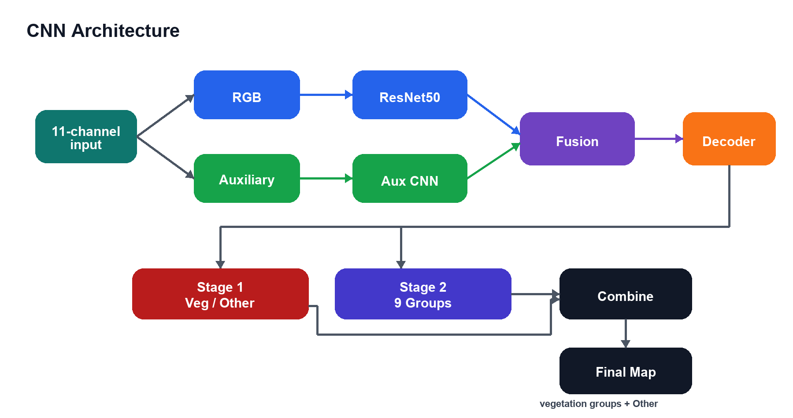

# Case Study

## Goal

The project explores how deep learning can support vegetation mapping across NSW using multi-channel geospatial inputs. The final system packages the model into an interface that can be used with prepared model tiles or raw aerial imagery plus LiDAR data.

## Data Representation

The model input is a `512 x 512` tile with 11 channels:

1. Red
2. Green
3. Blue
4. SoilCode
5. CHM
6. CanopyCover
7. StrataGround
8. StrataUnderstorey
9. StrataMidstorey
10. StrataCanopy
11. TWI

Raw inference builds this stack from RGB GeoTIFF imagery, ASC soil polygons, and ELVIS LAS/LAZ point-cloud data.

## Model Design

The final inference path uses two models:

- Binary vegetation / other segmentation.
- Nine-group vegetation segmentation for vegetation pixels.

This design keeps the second model focused on vegetation formations rather than forcing one model to jointly learn background and vegetation subclasses.

## Application Design

The browser UI handles file upload, GeoTIFF validation, bounding box extraction, LiDAR ordering guidance, inference progress, result rendering, and export controls. The FastAPI backend handles TensorFlow model loading, raw preprocessing, prediction, class summaries, preview PNG generation, and prediction GeoTIFF generation.

## Evaluation

The binary gate reached a held-out test mIoU of `0.6535`. The grouped vegetation classifier reached a held-out test mIoU of `0.2035`.

The lower grouped-class score reflects a harder task: several NSW vegetation formations share similar visual texture in aerial imagery, while class support varies strongly across regions.

## Outcome

The final deliverable is a working local inference tool with clear separation between frontend, API, model code, preprocessing code, and large model/geospatial assets.
