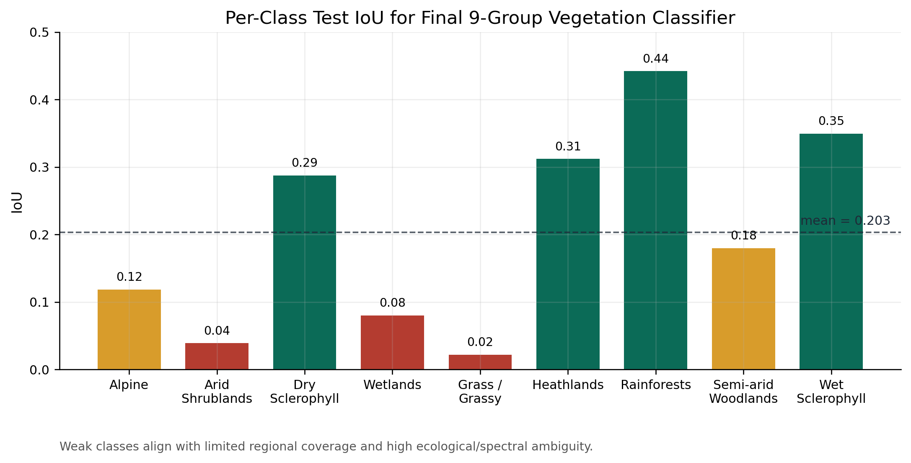

# Results

## Summary

| Component | Held-out test mIoU |
|---|---:|
| Binary vegetation gate | `0.6535` |
| Nine-group vegetation classifier | `0.2035` |

## Experiment Comparison

## Per-Class Behaviour

The grouped classifier has uneven performance because the task combines visually similar formations, region shifts, and imbalanced class support. The portfolio app keeps outputs inspectable through class summaries and map previews rather than presenting the model as a finished production classifier.
